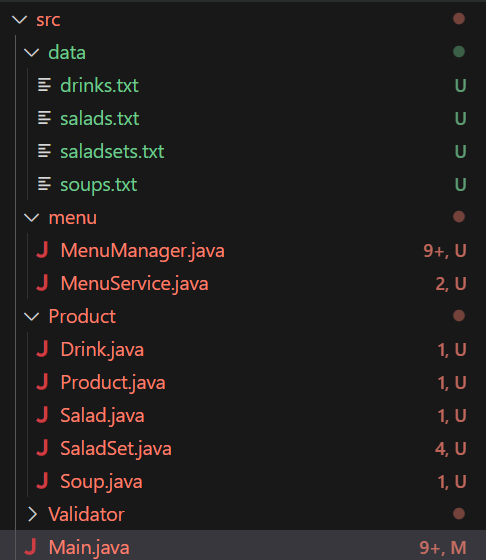

# NAHEUN'S TIL 

## 날짜: 2025-02-09

### 스크럼
- 1차 과제 수정
- 2차 과제 구현

### 오늘의 회고
- 추상 클래스나 데이터 파일 분류, validator 정리, menu관리하는 menumanager을 역할에 따라 분류하여 1차 코드 리팩토링을 진행했는데 패키지를 나누는 부분에서 계속 오류가 나서 진행을 못하고 있는 중이다...2차 과제는 1차 과제 수정 부분과 따로 구현하려고 리팩토링 중이다. extension이 java 버전과 충돌이 나는 문제가 생길 수 있다고 해서 uninstall하고 다시 설치해서 package 오류가 나지 않는 걸 확인하는데 파일을 옮기거나 폴더명을 바꾸면 다시 오류가 나서 이 문제를 해결하려고 하는 중이다.

### 참고 자료 및 링크
- 